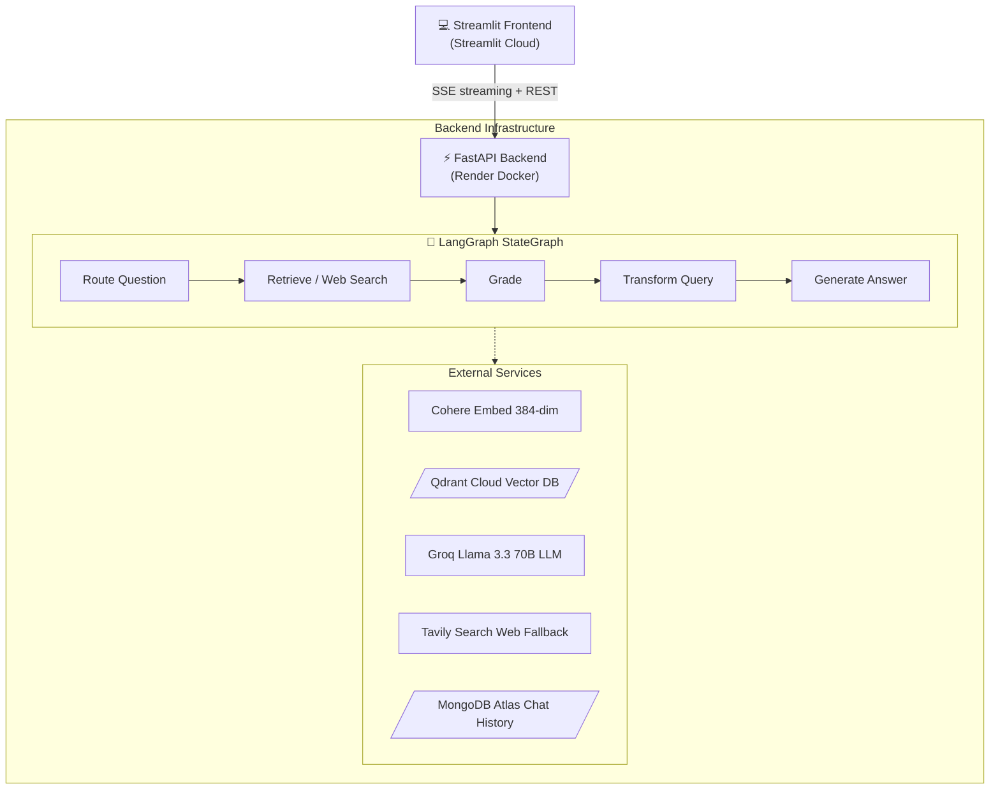
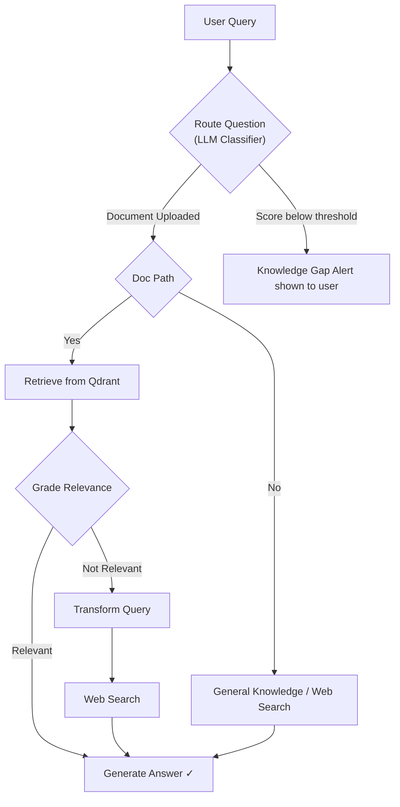

# Adaptive RAG — Intelligent Document Intelligence

> An end-to-end Retrieval-Augmented Generation system that dynamically routes queries across document knowledge bases, live web search, and general AI reasoning — deployed as a production-grade full-stack application.

[](https://adaptive-rag---knowledge-retrieval-3lzqznfonuduremjxvis7x.streamlit.app)
[](https://adaptive-rag-knowledge-retrieval.onrender.com/docs)
[](https://adaptive-rag-knowledge-retrieval.onrender.com)
[](https://github.com/Aditya0105singh/Adaptive-RAG---knowledge-retrieval)

---

## 🔗 Live Links

| Resource | URL |
|---|---|
| **Frontend — Streamlit Cloud** | https://adaptive-rag---knowledge-retrieval-3lzqznfonuduremjxvis7x.streamlit.app |
| **Backend API — Render** | https://adaptive-rag-knowledge-retrieval.onrender.com |
| **Interactive API Docs (Swagger)** | https://adaptive-rag-knowledge-retrieval.onrender.com/docs |
| **Health Check** | https://adaptive-rag-knowledge-retrieval.onrender.com/health |

---

## 📸 Application Visuals

> **Add your working visuals here!** 
> Replace the placeholder image below with a GIF or screenshot of your working application. You can easily do this by dragging and dropping an image into the GitHub editor.

<p align="center">
  
</p>

---

## What It Does

Upload any document (PDF, DOCX, TXT, MD, CSV) and ask questions in natural language. The system automatically decides the best retrieval strategy for each query:

- **Document retrieval** — semantic search over your uploaded content using parent-child chunking
- **Web search** — live Tavily search when the document does not contain the answer
- **General reasoning** — Groq Llama 3.3 70B for knowledge questions with no document needed

All responses stream token-by-token with full source attribution and a visible pipeline trace.

---

## Architecture



### Adaptive Routing Logic



---

## Key Features

### Document Intelligence
- **Multi-format support** — PDF, DOCX, TXT, Markdown, CSV (up to 5 files × 50 MB)
- **Parent-child chunking** — 1500-char parent / 400-char child for precision + context
- **Session-scoped Qdrant collections** — each session gets its own isolated vector store
- **Auto topic extraction** — key themes surfaced immediately after upload
- **Suggested questions** — AI-generated starter questions from document content
- **Document summary card** — one-paragraph overview shown in the sidebar

### Adaptive Retrieval
- **Semantic search** — Cohere `embed-english-light-v3.0` (384-dim dense vectors)
- **Relevance grading** — LLM grades retrieved chunks before answering
- **Query transformation** — rewrites weak queries to improve retrieval on retry
- **Web search fallback** — Tavily API for real-time information when docs fall short
- **Configurable threshold** — `RELEVANCE_THRESHOLD=0.6` (cosine similarity)

### Chat Experience
- **SSE streaming** — token-by-token response, no waiting for full answer
- **Pipeline transparency** — live stage indicator: routing → retrieving → grading → generating → done
- **Source attribution** — expandable source chunks with filename labels
- **Voice input** — Web Speech API mic button injected into Streamlit (Chrome)
- **Copy answer** — one-click copy with visual feedback
- **Conversation memory** — last 40 messages sent as context window history

### UI/UX
- Neural network logo (pure SVG, no images)
- Grounding Check / Answer Evolution / Knowledge Gap Alerts toggles
- Session cost tracker (token count + estimated cost)
- Query history sidebar
- Friendly error messages (rate limit, timeout, connection, API key)

---

## Tech Stack

### Backend
| Layer | Technology |
|---|---|
| API Framework | FastAPI 0.115 + Uvicorn |
| Agent Orchestration | LangGraph 1.2 (StateGraph + MemorySaver) |
| LLM | Groq — Llama 3.3 70B Versatile (`max_tokens=32768`) |
| Embeddings | Cohere `embed-english-light-v3.0` (384-dim, API-based) |
| Vector Database | Qdrant Cloud (cosine similarity, parent-child schema) |
| Web Search | Tavily API |
| Chat History | MongoDB Atlas (optional) |
| Observability | OpenTelemetry + structlog |
| Containerisation | Docker (python:3.12-slim) |
| Deployment | Render (free tier, auto-deploy from GitHub) |

### Frontend
| Layer | Technology |
|---|---|
| UI Framework | Streamlit |
| Streaming | Server-Sent Events via `requests` stream reader |
| Voice Input | Web Speech API (injected via `st.components.html`) |
| Deployment | Streamlit Community Cloud |

---

## Project Structure

```
adaptive_rag/
├── app.py                      # Streamlit frontend (single file)
├── main.py                     # FastAPI + Uvicorn entry point
├── Dockerfile                  # Backend container
├── requirements-backend.txt    # Backend-only deps (no torch / streamlit)
├── requirements.txt            # Full deps for local development
│
├── src/
│   ├── api/
│   │   ├── main.py             # FastAPI app, CORS, lifespan, error handlers
│   │   ├── routers/
│   │   │   ├── chat.py         # SSE streaming chat endpoint
│   │   │   ├── upload.py       # Document ingestion endpoint
│   │   │   └── suggestions.py  # Topic + question generation
│   │   └── schemas.py          # Pydantic request/response models
│   │
│   ├── agents/
│   │   ├── graph.py            # LangGraph StateGraph definition
│   │   ├── nodes.py            # Node functions: route / retrieve / grade / generate
│   │   └── state.py            # GraphState TypedDict
│   │
│   ├── services/
│   │   ├── embeddings.py       # Cohere embedding singleton
│   │   ├── ingestion.py        # Document parsing + chunking + Qdrant upsert
│   │   └── retrieval.py        # Semantic search over session Qdrant collection
│   │
│   └── core/
│       ├── config.py           # Pydantic settings (env var loading)
│       ├── database.py         # Qdrant + MongoDB client factories
│       └── logging.py          # structlog configuration
```

---

## Local Development

### Prerequisites
- Python 3.12+
- API keys (see environment variables below)

### Setup

```bash
git clone https://github.com/Aditya0105singh/Adaptive-RAG---knowledge-retrieval.git
cd Adaptive-RAG---knowledge-retrieval/adaptive_rag
pip install -r requirements.txt
```

Create `.env`:

```env
# LLM
GROQ_API_KEY=gsk_...
GROQ_MODEL=llama-3.3-70b-versatile

# Embeddings (free at dashboard.cohere.com)
COHERE_API_KEY=...

# Vector DB (free at cloud.qdrant.io)
QDRANT_URL=https://your-cluster.qdrant.io
QDRANT_API_KEY=...
QDRANT_COLLECTION=documents

# Web Search (free at app.tavily.com)
TAVILY_API_KEY=tvly-...

# Chat history (optional)
MONGO_URI=mongodb+srv://...

# Chunking config
EMBED_MODEL=sentence-transformers/all-MiniLM-L6-v2
EMBED_DIM=384
PARENT_CHUNK_SIZE=1500
CHILD_CHUNK_SIZE=400
RELEVANCE_THRESHOLD=0.6
LOG_LEVEL=INFO
```

### Run

```bash
# Terminal 1 — Backend API
python main.py
# Runs on http://localhost:8080

# Terminal 2 — Frontend
streamlit run app.py
# Opens http://localhost:8501
```

---

## API Reference

Full interactive docs: **https://adaptive-rag-knowledge-retrieval.onrender.com/docs**

### Endpoints

| Method | Path | Description |
|---|---|---|
| `GET` | `/health` | Liveness probe — returns `{"status":"ok"}` |
| `POST` | `/api/upload` | Upload and index a document |
| `POST` | `/api/chat/stream` | SSE streaming chat response |
| `GET` | `/api/sessions/{session_id}` | Fetch session chat history |
| `GET` | `/api/suggestions/{session_id}` | Get AI-generated topic chips |
| `GET` | `/api/insight/{session_id}` | Get document summary + key topics |

### Chat Stream Request

```json
POST /api/chat/stream
Content-Type: application/json

{
  "question": "What is PM4Py integration?",
  "session_id": "550e8400-e29b-41d4-a716-446655440000",
  "history": [
    {"role": "user", "content": "Tell me about the document"},
    {"role": "assistant", "content": "This document covers..."}
  ]
}
```

### SSE Event Stream

```
data: {"type": "stage",  "stage": "routing"}
data: {"type": "stage",  "stage": "retrieving"}
data: {"type": "stage",  "stage": "grading"}
data: {"type": "stage",  "stage": "generating"}
data: {"type": "token",  "content": "PM4Py"}
data: {"type": "token",  "content": " is a Python library..."}
data: {"type": "done",   "route": "index", "sources": [...], "usage": {...}}
```

---

## Deployment Guide

### Backend → Render

1. Push repo to GitHub
2. Render dashboard → **New Web Service** → connect repo
3. Runtime: **Docker** | Branch: `main` | Root: `adaptive_rag`
4. Add environment variables (Render → Environment tab)
5. Deploy — auto-redeploys on every push to `main`

### Frontend → Streamlit Cloud

1. Go to [share.streamlit.io](https://share.streamlit.io)
2. Connect GitHub → select repo → main file: `adaptive_rag/app.py`
3. Add secrets (Streamlit Cloud → Settings → Secrets):

```toml
GROQ_API_KEY = "gsk_..."
QDRANT_URL = "https://..."
QDRANT_API_KEY = "..."
TAVILY_API_KEY = "tvly-..."
API_URL = "https://adaptive-rag-knowledge-retrieval.onrender.com"
```

### Environment Variables Reference

| Variable | Required | Service | Description |
|---|---|---|---|
| `GROQ_API_KEY` | ✅ | Both | Groq LLM key — [console.groq.com](https://console.groq.com) |
| `COHERE_API_KEY` | ✅ | Backend | Cohere embed key — [dashboard.cohere.com](https://dashboard.cohere.com) |
| `QDRANT_URL` | ✅ | Both | Qdrant cluster URL — [cloud.qdrant.io](https://cloud.qdrant.io) |
| `QDRANT_API_KEY` | ✅ | Both | Qdrant API key |
| `TAVILY_API_KEY` | ✅ | Backend | Tavily search key — [app.tavily.com](https://app.tavily.com) |
| `API_URL` | ✅ | Frontend | Full Render backend URL |
| `MONGO_URI` | ⬜ | Backend | MongoDB for chat history (optional) |
| `GROQ_MODEL` | ⬜ | Backend | Default: `llama-3.3-70b-versatile` |

---

## Design Decisions

**Why parent-child chunking?**
Small child chunks (400 chars) give precise cosine-similarity matches; returning the full parent chunk (1500 chars) gives the LLM sufficient context to form a complete answer. Standard single-chunk RAG loses one or the other.

**Why adaptive routing instead of always retrieving?**
For general questions ("What is machine learning?") retrieval adds latency with no benefit. The routing node classifies intent first so each query takes the optimal path: document, web, or direct LLM.

**Why SSE instead of WebSockets?**
SSE is unidirectional (server → client), works natively with FastAPI `StreamingResponse`, and is simpler to implement for LLM token streaming. WebSockets add bidirectional complexity with no benefit for this use case.

**Why Cohere for embeddings instead of a local model?**
Local sentence-transformers (PyTorch) consumes ~300 MB RAM. Cohere's API-based embeddings use ~0 MB RAM — critical for fitting within Render's 512 MB free tier limit. Same 384-dim output, no retrieval quality loss.

**Why LangGraph over a plain LangChain chain?**
LangGraph's StateGraph exposes every routing decision as a node transition, making it trivial to add conditional edges (grade → transform → retry) without tangled chain callbacks. The graph is also checkpointed per-thread for future multi-turn memory.

---

## Known Limitations (Free Tier)

| Constraint | Limit | Notes |
|---|---|---|
| Groq rate limit | 6,000 tokens / min | Wait 60 s between heavy queries |
| Render RAM | 512 MB | Solved via API-based embeddings |
| Render spin-down | ~50 s cold start | First request after idle period |
| Cohere free tier | 1,000 embed calls / month | Sufficient for demos |
| Qdrant free tier | 1 GB vector storage | Sufficient for document demos |

---

## Author

**Aditya Singh**
- GitHub: [@Aditya0105singh](https://github.com/Aditya0105singh)
- Email: adityasingh01517@gmail.com

---

*Built as a placement project demonstrating production RAG architecture with adaptive retrieval, streaming responses, and full-stack cloud deployment.*
