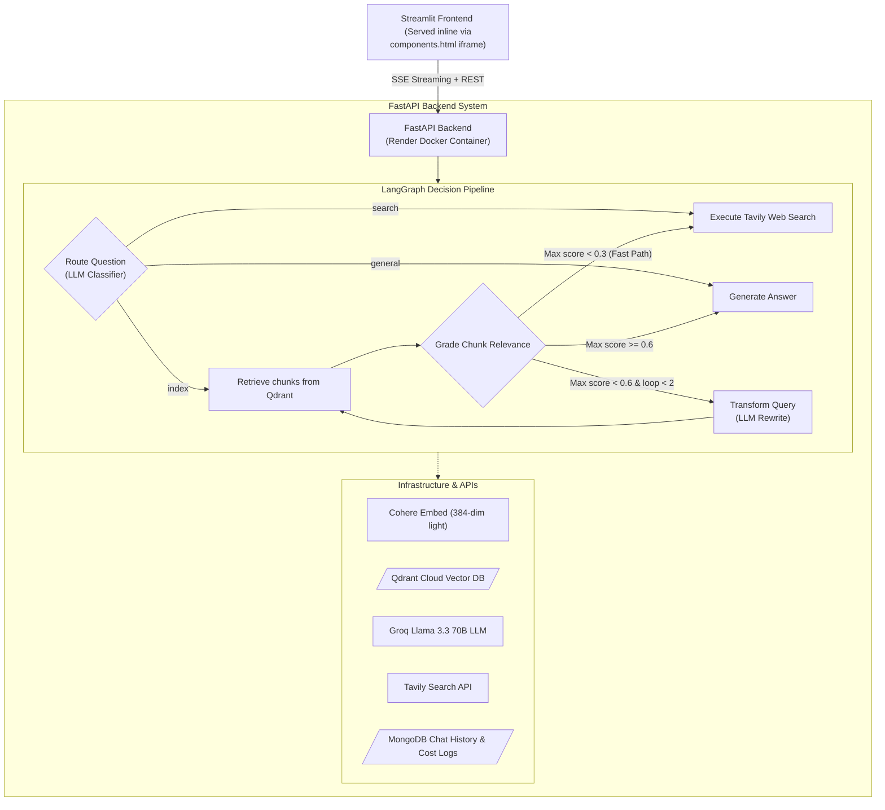
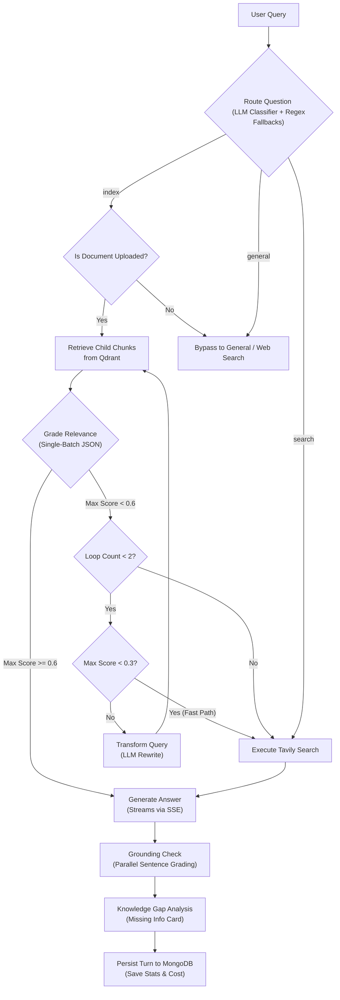

# Adaptive RAG AI: Dynamic Query Routing & Retrieval System

A full-stack Retrieval-Augmented Generation (RAG) system that uses LangGraph and FastAPI to dynamically route user queries between local document index, live web search, and direct LLM reasoning. 

I built this project to demonstrate a production-ready RAG architecture that solves the rigidity and latency issues of naive RAG setups. Instead of blindly executing vector searches for every input, the system checks query intent first and adapts the retrieval path accordingly.

[](https://adaptive-rag---knowledge-retrieval-3lzqznfonuduremjxvis7x.streamlit.app)
[](https://adaptive-rag-knowledge-retrieval.onrender.com/docs)
[](https://adaptive-rag-knowledge-retrieval.onrender.com)
[](https://github.com/Aditya0105singh/Adaptive-RAG---knowledge-retrieval)

---

## Live Links

*   **Frontend UI (Streamlit App Shell)**: [adaptive-rag-app.streamlit.app](https://adaptive-rag---knowledge-retrieval-3lzqznfonuduremjxvis7x.streamlit.app)
*   **Backend API (Render Docker Container)**: [adaptive-rag-backend.onrender.com](https://adaptive-rag-knowledge-retrieval.onrender.com)
*   **API Docs (Swagger UI)**: [adaptive-rag-backend.onrender.com/docs](https://adaptive-rag-knowledge-retrieval.onrender.com/docs)
*   **API Health Status**: [adaptive-rag-backend.onrender.com/health](https://adaptive-rag-knowledge-retrieval.onrender.com/health)

---

## How it Works

The backend uses **LangGraph** to model the decision flow as a state machine. When a question is submitted, the system classifies its intent and takes one of three routes:

1.  **Document Index**: Queries specific to the uploaded file. Runs semantic search on Qdrant, grades retrieval relevance, and rewrites the query if the match is too weak.
2.  **Web Search**: Triggered if no document is uploaded, if the document retrieval relevance fails the threshold, or if the user asks for real-time information (e.g. stock prices, current events). Powered by Tavily.
3.  **General Reasoning**: Straight LLM generation for general chitchat, greetings, coding help, or math. This completely bypasses vector databases, saving latency.

### System Architecture



### Retrieval & Self-Correction Flow



---

## Core Design Choices

### Parent-Child Chunking
Single-size chunking forces a trade-off: small chunks match search queries precisely but lack context, while large chunks preserve context but dilute search relevance. 
To resolve this:
*   I split documents into **Parent Chunks** of 1,500 characters (~300 words, 200 overlap) and **Child Chunks** of 400 characters (~80 words, 50 overlap).
*   Only the child chunks are embedded and indexed in Qdrant.
*   Each child chunk's metadata stores the ID and full text of its parent.
*   At query time, the system retrieves the top child matches, maps them to their parents, deduplicates the parent IDs (so multiple child hits from the same section don't clutter the prompt), and sends the unique parent chunks to the LLM.

### Multi-Provider LLM Fallback Pool
To handle API rate limits (which happen often when testing Llama 3.3 on Groq's free-tier 6,000 TPM limit), I built a resilient fallback sequence:
`Groq (Key Rotation Pool) -> Gemini 2.0 Flash -> Cerebras (Gemma 31B) -> Cohere Command-R`
*   **Mid-Stream Recovery**: If a rate limit error is raised mid-generation, the Server-Sent Events (SSE) generator catches it. It measures the character count emitted so far, sends backspace characters (`\x08`) to clean up the partial text on the client's screen, switches to the next LLM provider, and resumes streaming the response.
*   **Custom Cerebras Adapter**: The standard LangChain OpenAI adapter triggers Pydantic schema validation conflicts across dependencies, so I wrote a custom, direct HTTP handler using raw requests and SSE yield loops.

### Single-Batch Relevance Grading & The "Fast Path"
Instead of sending sequential LLM calls to grade each retrieved document chunk (which adds tons of latency), the system sends a single batched prompt. It sends the query and a numbered list of all retrieved chunks, asking the LLM to return a raw JSON float array of scores (e.g. `[0.85, 0.20, 0.90]`).
*   **Relevance Threshold**: Chunks with scores $\ge 0.6$ are kept. 
*   **The Fast Path**: If the best chunk retrieved on the first attempt scores $< 0.3$, it usually means the document has no information on the topic. The system skips the query-rewriting loop entirely and jumps straight to Web Search, saving 1–2 seconds.

### Grounding Evaluator (Ablation Comparison)
I built two alternative grounding modes to check for hallucinations:
1.  **LLM Grounding**: Splits the generated answer into sentences and runs parallel LLM calls (`ThreadPoolExecutor` with 6 workers) to classify each sentence as `GROUNDED` (explicitly backed by sources), `INFERRED` (logical deduction), or `UNGROUNDED` (hallucination).
2.  **Embedding-based Grounding (Ablation)**: Runs zero LLM calls. It calculates cosine similarity between each sentence vector and the retrieved source vectors. It maps scores $\ge 0.75 \implies$ GROUNDED, $\ge 0.50 \implies$ INFERRED, and $< 0.50 \implies$ UNGROUNDED. 
The UI exposes a `/api/grounding/compare` endpoint to compare the speed and accuracy of both approaches side-by-side.

### Knowledge Gap Analyzer
If the context isn't fully comprehensive, the LLM analyzes what is missing. It outputs a Trust Score (0-100%), up to 4 missing points, and suggests what other documents the user should upload (e.g., "Upload your resume or W2 form"). These results are cached using an MD5 hash of `Question + Digests of Retrieved Chunks` with a 600-second TTL to prevent duplicate calls.

---

## Frontend & UI Implementation

*   **Fixed Viewport Layout**: Streamlit iframes do not support standard `position:fixed` CSS properties cleanly. I bypassed this by writing a custom Flexbox column layout where the chat input wrapper is pinned to the bottom. An iframe-side `MutationObserver` listens for new message cards and triggers `postMessage('streamlit:setFrameHeight')` to resize the viewport container dynamically.
*   **Voice Input**: Integrated browser-native SpeechRecognition (`WebSpeechAPI`). I injected a raw value setter into the React DOM prototype of the Streamlit text area to ensure text injected by voice input triggers React's state handlers.
*   **Session Stats & Costs**: Added a live sidebar dashboard that aggregates total session queries, route counts, average response latency, and calculates the exact cost in USD based on actual token usage counts and model pricing tables.

---

## Benchmarks & Evaluation

I evaluated this adaptive pipeline against a **Naive RAG baseline** (which always retrieves, runs no grading, and uses single-shot generation) on the same document set and evaluation queries. Performance was measured using the **[RAGAS](https://docs.ragas.io)** framework, judged by `llama-3.1-8b-instant`.

### RAGAS Evaluation Results

| Metric | Naive RAG | Adaptive RAG | Δ (Improvement) |
|--------|-----------|--------------|-----------------|
| **Faithfulness** | 0.759 | **0.816** | **+7%** |
| **Context Precision** | 0.875 | **1.000** | **+14%** |
| **Answer Relevancy** | 0.528 | 0.500 | ~Tied |
| **Avg Latency (ms)** | 1089 | 4773 | +3.7× (due to routing + grading steps) |

*The relevance grader filters out off-topic text chunks before generation, leading to **perfect context precision (1.000)** and higher faithfulness. The trade-off is higher latency due to the extra LLM calls for classification and grading.*

### Routing Accuracy & Latency Per Route
Tested via `evaluate/test_routing.py` (25-question labeled test set):
*   **Routing Accuracy**: **25/25 (100%)**
*   **Measured End-to-End Latency** (wall-clock, including network):

| Route | sample count | Average Latency | P50 | P95 |
|-------|---|---|---|---|
| **Index (Document)** | 3 | 5,813 ms | 4,910 ms | 7,782 ms |
| **General Reasoning** | 3 | 7,737 ms | 8,376 ms | 9,052 ms |
| **Web Search** | 3 | 5,278 ms | 5,493 ms | 5,513 ms |
| **Overall** | **9** | **6,276 ms** | **5,513 ms** | **9,052 ms** |

---

## Known Bugs Fixed

During development, I fixed several critical layout, token rate, and connection bugs:

| Bug | Root Cause | Resolution |
|-----|-----------|------------|
| Chat input invisible on refresh | `position:fixed` behaves inconsistently inside Streamlit iframes | Rewrote UI using a pure CSS Flexbox layout |
| Viewport clipping reasoning logs | Absolute positioning of the reasoning badge was clipped by `.card` overflow limits | Moved the reasoning status dot to render inline |
| Cohere vector upload crashes | Ingestion service sent batches of 100 texts, exceeding Cohere's API batch limit of 96 | Reduced vector processing batch size to 90 |
| Stream drops on Render proxy | Render's reverse proxy kills HTTP connections if idle for 30 seconds | Added a background task that yields keepalive comments (`: keepalive\n\n`) every 5 seconds |
| Rapid API quota exhaustion | LLM execution defaulted to a `max_tokens` limit of 32,768, which filled up TPM budgets | Capped default generation tokens to 1,024 |
| Slow routing on startup | Fast API and LangGraph loaded heavy local PyTorch dependencies | Switched to ONNX runtime (`fastembed`) and mocked PyTorch imports during execution |

---

## Project Structure & File Links

```
adaptive_rag/
├── app.py                      # Streamlit frontend shell
├── main.py                     # FastAPI backend entry point
├── Dockerfile                  # Container definition
├── requirements.txt            # Python dependencies
│
├── src/
│   ├── api/
│   │   ├── main.py             # API config, CORS headers, and error hooks
│   │   ├── routers/
│   │   │   ├── chat.py         # SSE stream endpoint with graph executor
│   │   │   ├── upload.py       # Ingestion and vector indexing router
│   │   │   ├── suggestions.py  # Topics generator endpoint
│   │   │   └── system.py       # Cost, history, and status endpoints
│   │   └── schemas.py          # Request validation models
│   │
│   ├── agents/
│   │   ├── graph.py            # LangGraph configuration
│   │   ├── nodes.py            # Node step implementations
│   │   ├── edges.py            # Routing conditions
│   │   └── state.py            # State dict model
│   │
│   ├── services/
│   │   ├── ingestion.py        # File parsers, chunking, and indexer
│   │   ├── retrieval.py        # Vector search resolver
│   │   ├── embeddings.py       # Embedding API client
│   │   ├── search.py           # Web search connector
│   │   ├── grounding_checker.py # Parallel LLM grounding check
│   │   ├── grounding_checker_embedding.py # Embedding similarity grounding check
│   │   ├── knowledge_gap_analyzer.py # Missing info generator + Cache
│   │   └── cost_tracker.py     # Token pricing calculator
│   │
│   └── core/
│       ├── config.py           # Settings config loader
│       ├── database.py         # Qdrant + MongoDB connections
│       └── logging.py          # Structured logs wrapper
│
├── frontend/
│   ├── index.html              # Custom SPA UI layout
│   └── app.js                  # SSE connection handler and DOM scripts
│
└── evaluate/
    ├── naive_rag.py            # Naive baseline runner
    ├── ragas_eval.py           # RAGAS metrics runner
    ├── compare.py              # Report generation script
    ├── test_routing.py         # Router accuracy tests
    └── benchmark_latency.py    # Latency benchmarking script
```

### File Map
*   **App Shell**: [`app.py`](file:///d:/1%20placement/project/Adaptive%20RAG/app.py)
*   **UI Components**: [`frontend/index.html`](file:///d:/1%20placement/project/Adaptive%20RAG/frontend/index.html) | [`frontend/app.js`](file:///d:/1%20placement/project/Adaptive%20RAG/frontend/app.js)
*   **API Base**: [`main.py`](file:///d:/1%20placement/project/Adaptive%20RAG/main.py) | [`src/api/main.py`](file:///d:/1%20placement/project/Adaptive%20RAG/src/api/main.py)
*   **Routing & SSE**: [`src/api/routers/chat.py`](file:///d:/1%20placement/project/Adaptive%20RAG/src/api/routers/chat.py)
*   **Ingestion Endpoint**: [`src/api/routers/upload.py`](file:///d:/1%20placement/project/Adaptive%20RAG/src/api/routers/upload.py)
*   **LangGraph Graph**: [`src/agents/graph.py`](file:///d:/1%20placement/project/Adaptive%20RAG/src/agents/graph.py)
*   **LangGraph Nodes**: [`src/agents/nodes.py`](file:///d:/1%20placement/project/Adaptive%20RAG/src/agents/nodes.py)
*   **Ingestion logic**: [`src/services/ingestion.py`](file:///d:/1%20placement/project/Adaptive%20RAG/src/services/ingestion.py)
*   **Retrieval logic**: [`src/services/retrieval.py`](file:///d:/1%20placement/project/Adaptive%20RAG/src/services/retrieval.py)
*   **Grounding logic**: [`src/services/grounding_checker.py`](file:///d:/1%20placement/project/Adaptive%20RAG/src/services/grounding_checker.py) | [`src/services/grounding_checker_embedding.py`](file:///d:/1%20placement/project/Adaptive%20RAG/src/services/grounding_checker_embedding.py)
*   **Knowledge Gap Engine**: [`src/services/knowledge_gap_analyzer.py`](file:///d:/1%20placement/project/Adaptive%20RAG/src/services/knowledge_gap_analyzer.py)
*   **Cost Analyzer**: [`src/services/cost_tracker.py`](file:///d:/1%20placement/project/Adaptive%20RAG/src/services/cost_tracker.py)
*   **DB Clients**: [`src/core/database.py`](file:///d:/1%20placement/project/Adaptive%20RAG/src/core/database.py)

---

## Setup & Local Run

### Prerequisites
*   Python 3.12+
*   API keys for Groq, Cohere, Tavily, and a Qdrant Cloud cluster (all have free tiers).

### Installation

1.  **Clone the Repo**:
    ```bash
    git clone https://github.com/Aditya0105singh/Adaptive-RAG---knowledge-retrieval.git
    cd Adaptive-RAG---knowledge-retrieval
    ```

2.  **Install dependencies**:
    ```bash
    pip install -r requirements.txt
    ```

3.  **Setup Environment Variables** (Create a `.env` file at the root):
    ```env
    GROQ_API_KEY=gsk_...
    GROQ_MODEL=llama-3.3-70b-versatile
    COHERE_API_KEY=...
    QDRANT_URL=https://your-qdrant-cluster.io
    QDRANT_API_KEY=...
    QDRANT_COLLECTION=documents
    TAVILY_API_KEY=tvly-...
    API_PORT=8080
    PARENT_CHUNK_SIZE=1500
    CHILD_CHUNK_SIZE=400
    RELEVANCE_THRESHOLD=0.6
    LOG_LEVEL=INFO
    # Optional MongoDB Atlas URI for persistent chat history
    MONGO_URI=mongodb+srv://...
    ```

4.  **Run Applications**:
    ```bash
    # Terminal 1: Start FastAPI backend
    python main.py

    # Terminal 2: Start Streamlit interface
    streamlit run app.py
    ```

5.  **Run Evaluation Suite**:
    ```bash
    # Test intent router accuracy
    python evaluate/test_routing.py

    # Run RAGAS metrics on the adaptive system
    python evaluate/ragas_eval.py

    # Run RAGAS metrics on the naive baseline
    python evaluate/naive_rag.py

    # Compile the final comparison markdown report
    python evaluate/compare.py
    ```

---

## API Spec & SSE Protocol

### Endpoints

| Method | Path | Description |
|---|---|---|
| `GET` | `/health` | API liveness status checks |
| `POST` | `/api/upload` | Parses multi-format documents, embeds text chunks, and upserts to Qdrant |
| `POST` | `/api/chat/stream` | Starts the SSE pipeline, executes LangGraph nodes, and streams tokens |
| `GET` | `/api/sessions/{session_id}` | Retrieves persistent chat logs from MongoDB |
| `GET` | `/api/suggestions/{session_id}` | Generates topic recommendation chips based on upload context |
| `GET` | `/api/insight/{session_id}` | Generates a structural summary card for the sidebar |

### SSE Event Stream Example
The backend streams updates dynamically via `text/event-stream` format:
```
data: {"type": "stage", "stage": "routing"}
data: {"type": "stage", "stage": "retrieving"}
data: {"type": "stage", "stage": "grading"}
data: {"type": "stage", "stage": "generating"}
data: {"type": "token", "content": "Adaptive"}
data: {"type": "token", "content": " RAG"}
data: {"type": "token", "content": " system..."}
data: {"type": "done", "route": "index", "sources": [{"filename": "doc.pdf", "content": "..."}], "usage": {"prompt_tokens": 800, "completion_tokens": 120}, "cost_usd": 0.00054}
```

---

## Deployment

### Backend on Render
1.  Connected the repository to the Render dashboard.
2.  Selected the **Docker** runtime environment.
3.  Set the base directory path to `adaptive_rag`.
4.  Configured the required `.env` keys in the Render Environment Variables tab. The service redeploys automatically on git push events.

### Frontend on Streamlit Cloud
1.  Logged into [share.streamlit.io](https://share.streamlit.io).
2.  Selected the repository, set the deployment branch to `main`, and pointed the entry file to `adaptive_rag/app.py`.
3.  Added environment secrets (including the Render backend URL mapped to `API_URL`).

---

## Future Work (Deferred Tasks)

*   **Render Cold-Start Ping**: Render free tier instances sleep after 15 minutes of inactivity. I plan to set up a free UptimeRobot monitor checking `/health` every 14 minutes to keep the container awake.
*   **Qdrant Free-Tier Activity**: Qdrant shuts down free clusters after 30 days without API activity. If needed, I can refactor the vector factory in `database.py` to run fully in-memory locally.
*   **Session History Caching**: Currently, refreshing the browser page wipes all session history inside the frontend iframe. Moving chat logs to `sessionStorage` would fix this issue.

---

## Author

**Aditya Singh**
*   **Email**: adityasingh01052003@gmail.com / adityasingh01517@gmail.com
*   **GitHub**: [@Aditya0105singh](https://github.com/Aditya0105singh)
